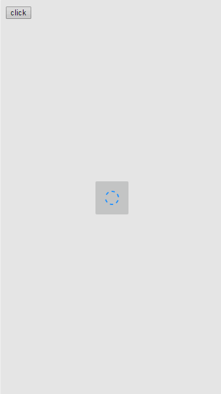

自动给vue-resource的ajax请求添加loadingbar。默认请求时间超过300毫秒才显示，可以手动配置延迟的时间

## add loading bar for Vue-resource or axios
vuejs and vue-resource ([axios](https://github.com/mzabriskie/axios)) required;

## 截图



## 安装
> npm install vueLoadingBar --save

``` html
<head>
    ...
    <link href="src/loadingbar.min.css" rel="stylesheet" type="text/css" />
</head>
<body>
    ...
    <script src='src/loadingbar.js'></script>
</body>
```

or

```javascript
require('src/loadingbar.js')(Vue);
```

with webpack

```javascript
...
import 'vueLoadingBar/src/loadingbar.css';
import Vue from 'vue';
import VueResource from 'vue-resource';
import vueLoadingBar from 'vueLoadingBar';
Vue.use(VueResource);
Vue.use(vueLoadingBar);
```

## 注意

如果使用其他支持interceptors的第三方库，需要将第三方库挂载到Vue.http；

使用axios时可以不做任何处理或者绑定到Vue.axios、Vue.$axios

## config

```javascript
// 设置请求超过多少毫秒才显示，默认300毫秒
new Vue({...}).loadingBarDelay = 100;
```
